<div align="center">

# STCLNet-ULM

### STCLNet-T: Efficient Spatiotemporal Localization<br>for Ultrasound Localization Microscopy

**Lightweight localization · Spatiotemporal modeling · High-throughput ULM**

[Overview](#overview) · [Reconstruction gallery](#reconstruction-gallery) · [Image index](#image-index) · [Repository structure](#repository-structure)

<br>

<a href="PALA_results/intensity/RatBrain.png">
  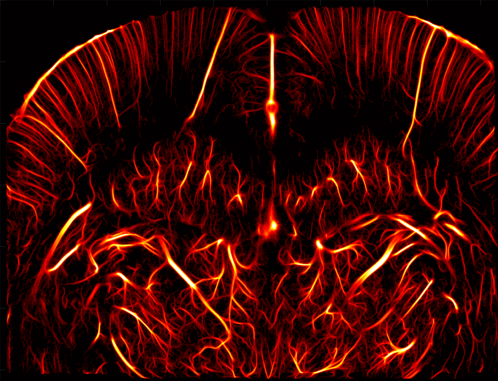
</a>

*Microvascular reconstruction of the rat brain on the public PALA dataset.*

**4 samples &nbsp; / &nbsp; 3 visualization types &nbsp; / &nbsp; 12 reconstruction images**

</div>

---

## Overview

**STCLNet-T** is a lightweight three-input, three-output spatiotemporal localization network for high-throughput ultrasound localization microscopy (ULM).

This repository presents additional reconstruction results on the public **PALA dataset**, with complementary views of vascular structure and flow.

| Intensity | Direction | Velocity |
| :--- | :--- | :--- |
| Reconstruction intensity maps | Flow-direction visualizations | Velocity-magnitude maps |

## Reconstruction gallery

Explore each sample across the three visualization types. **Click any image to open the full-resolution PNG.** Color scales and annotations are retained as provided in the original images.

### Rat brain

<table>
  <thead>
    <tr>
      <th width="33%">Intensity</th>
      <th width="33%">Direction</th>
      <th width="33%">Velocity</th>
    </tr>
  </thead>
  <tbody>
    <tr>
      <td align="center"><a href="PALA_results/intensity/RatBrain.png"></a></td>
      <td align="center"><a href="PALA_results/direction/RatBrain.png">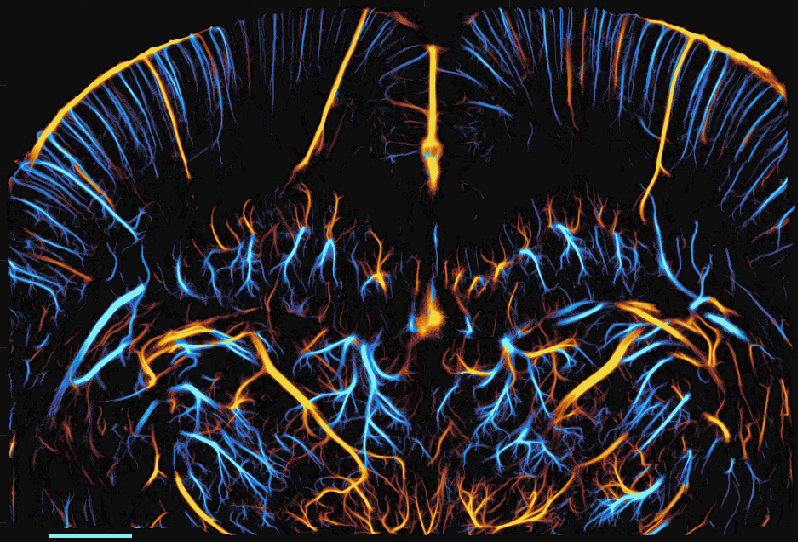</a></td>
      <td align="center"><a href="PALA_results/velocity/RatBrain.png">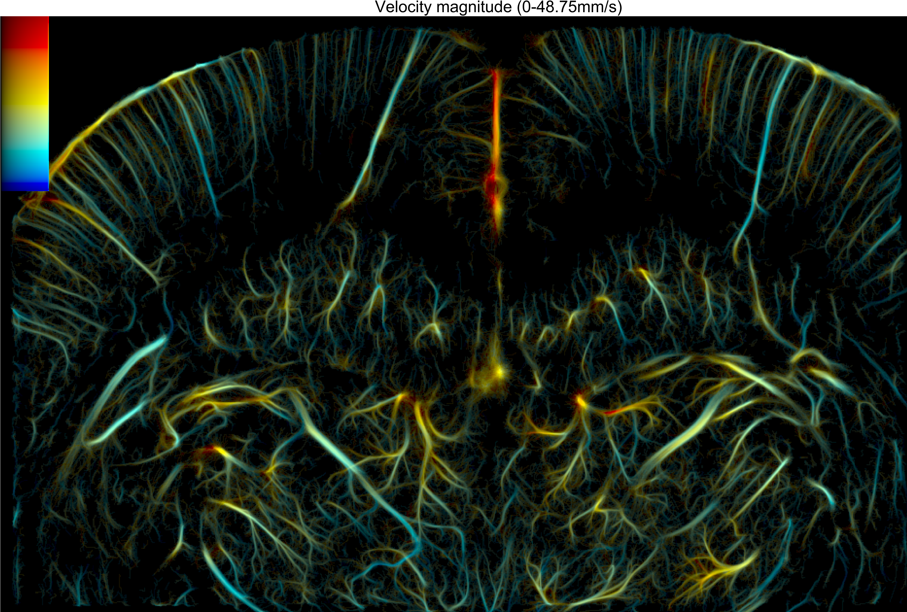</a></td>
    </tr>
  </tbody>
</table>

### Rat brain · bolus

<table>
  <thead>
    <tr>
      <th width="33%">Intensity</th>
      <th width="33%">Direction</th>
      <th width="33%">Velocity</th>
    </tr>
  </thead>
  <tbody>
    <tr>
      <td align="center"><a href="PALA_results/intensity/RatBrainBolus.png">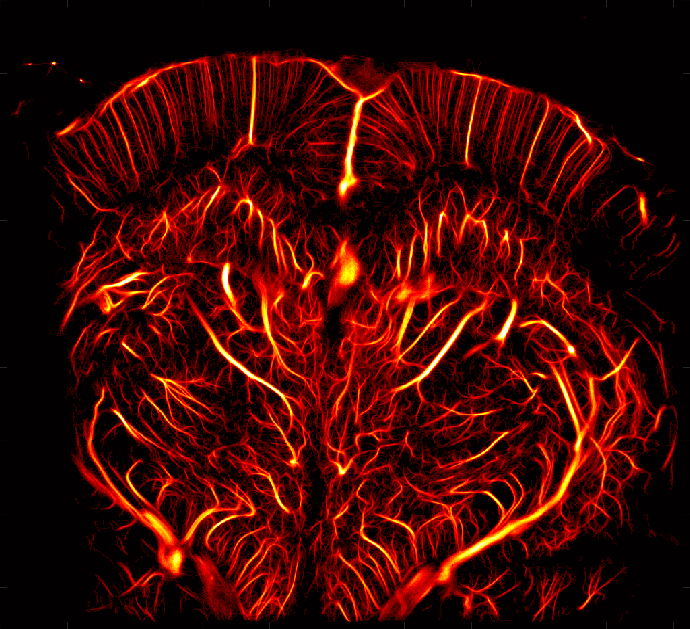</a></td>
      <td align="center"><a href="PALA_results/direction/RatBrainBolus.png">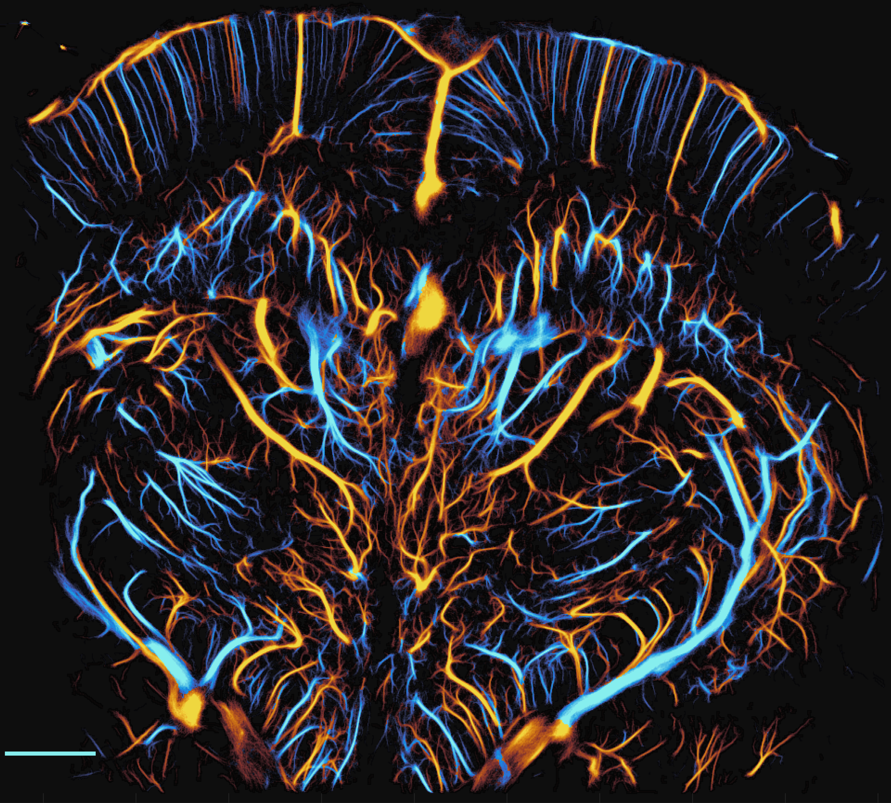</a></td>
      <td align="center"><a href="PALA_results/velocity/RatBrainBolus.png">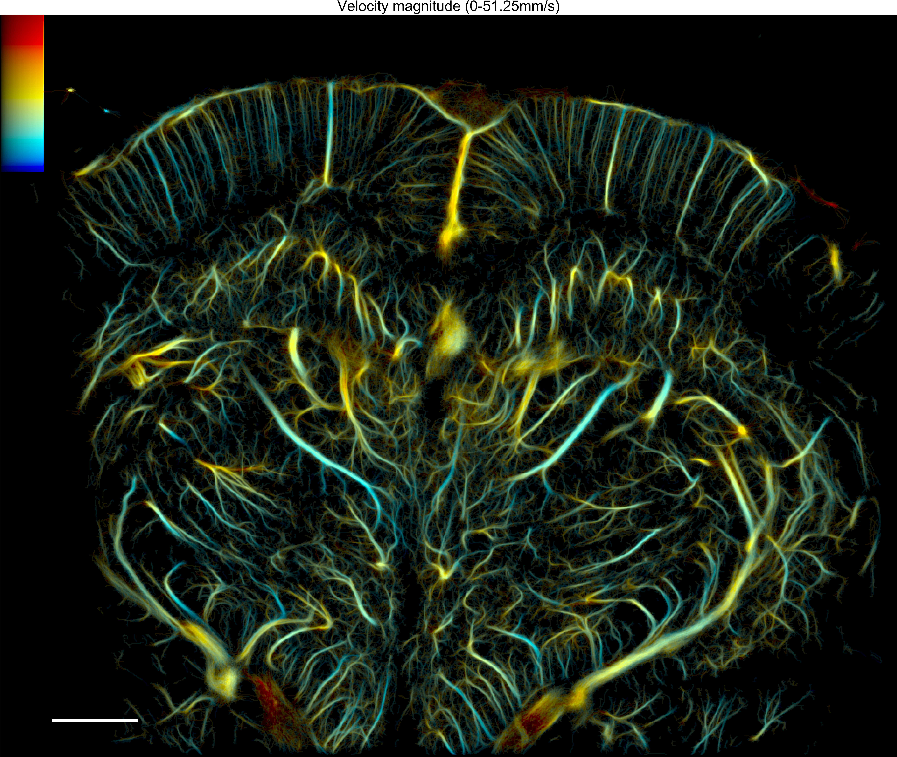</a></td>
    </tr>
  </tbody>
</table>

### Rat kidney

<table>
  <thead>
    <tr>
      <th width="33%">Intensity</th>
      <th width="33%">Direction</th>
      <th width="33%">Velocity</th>
    </tr>
  </thead>
  <tbody>
    <tr>
      <td align="center"><a href="PALA_results/intensity/RatKidney.png">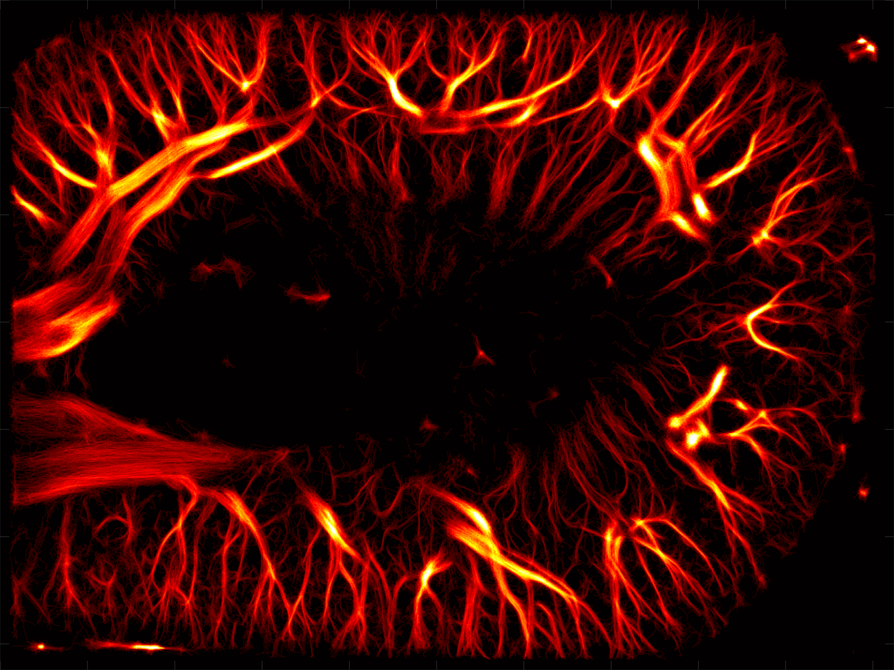</a></td>
      <td align="center"><a href="PALA_results/direction/RatKidney.png">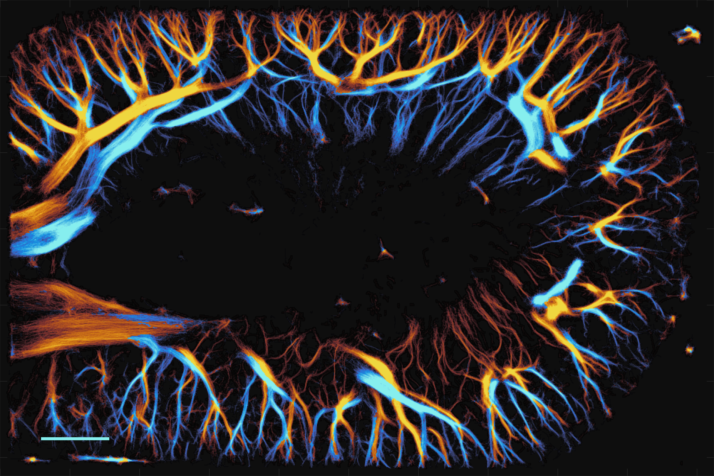</a></td>
      <td align="center"><a href="PALA_results/velocity/Kidney.png">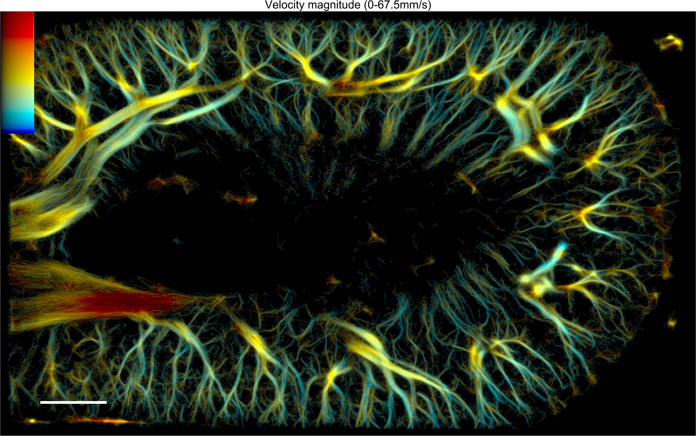</a></td>
    </tr>
  </tbody>
</table>

### Mouse tumor

<table>
  <thead>
    <tr>
      <th width="33%">Intensity</th>
      <th width="33%">Direction</th>
      <th width="33%">Velocity</th>
    </tr>
  </thead>
  <tbody>
    <tr>
      <td align="center"><a href="PALA_results/intensity/MouseTumor.png">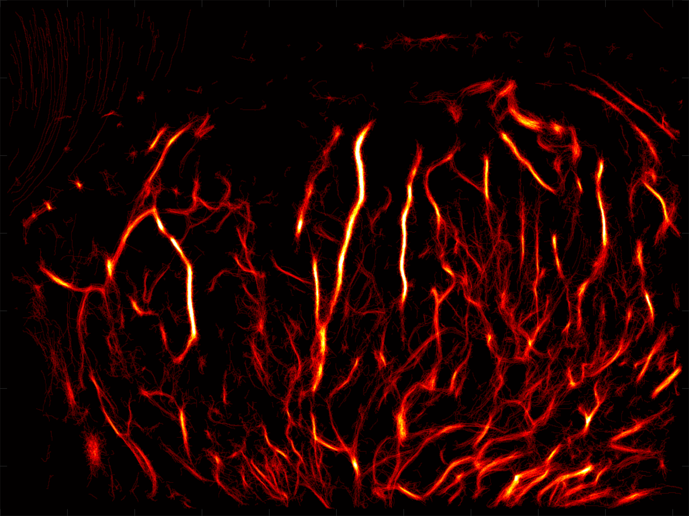</a></td>
      <td align="center"><a href="PALA_results/direction/MouseTumor.png">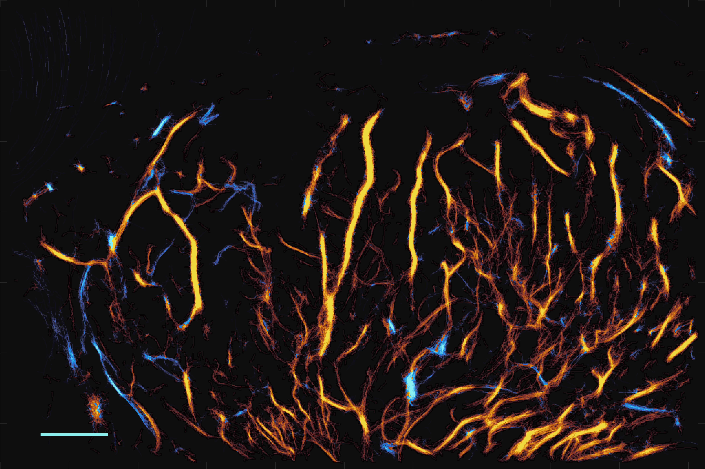</a></td>
      <td align="center"><a href="PALA_results/velocity/MouseTumor.png">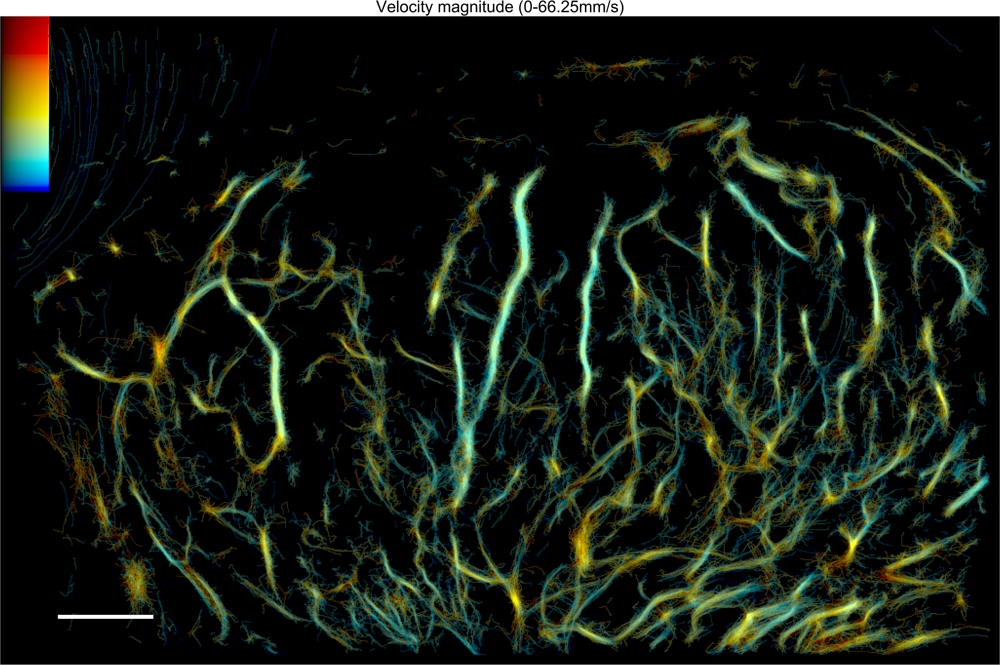</a></td>
    </tr>
  </tbody>
</table>

## Image index

Direct links to all full-resolution reconstructions.

| Sample | Intensity | Direction | Velocity |
| :--- | :---: | :---: | :---: |
| Rat brain | [PNG](PALA_results/intensity/RatBrain.png) | [PNG](PALA_results/direction/RatBrain.png) | [PNG](PALA_results/velocity/RatBrain.png) |
| Rat brain · bolus | [PNG](PALA_results/intensity/RatBrainBolus.png) | [PNG](PALA_results/direction/RatBrainBolus.png) | [PNG](PALA_results/velocity/RatBrainBolus.png) |
| Rat kidney | [PNG](PALA_results/intensity/RatKidney.png) | [PNG](PALA_results/direction/RatKidney.png) | [PNG](PALA_results/velocity/Kidney.png) |
| Mouse tumor | [PNG](PALA_results/intensity/MouseTumor.png) | [PNG](PALA_results/direction/MouseTumor.png) | [PNG](PALA_results/velocity/MouseTumor.png) |

<details>
<summary><strong>Viewing notes</strong></summary>

- Open the original PNG to inspect fine vascular details and image annotations.
- Gallery images are scaled for display; source files retain their original resolution.
- Read velocity ranges from the annotations in each source image.
- The rat kidney velocity file is named `Kidney.png`; its intensity and direction files are named `RatKidney.png`.

</details>

## Repository structure

```text
STCLNet-ULM/
├── README.md
└── PALA_results/
    ├── intensity/
    │   ├── RatBrain.png
    │   ├── RatBrainBolus.png
    │   ├── RatKidney.png
    │   └── MouseTumor.png
    ├── direction/
    │   ├── RatBrain.png
    │   ├── RatBrainBolus.png
    │   ├── RatKidney.png
    │   └── MouseTumor.png
    └── velocity/
        ├── RatBrain.png
        ├── RatBrainBolus.png
        ├── Kidney.png
        └── MouseTumor.png
```

<!-- Add manuscript, citation, code, and video links here once their public locations are available. -->

---

<div align="center">

**STCLNet-T** · Ultrasound Localization Microscopy<br>
[Back to top](#stclnet-ulm)

</div>
